# WANDERLUST 
 
### Top 5 Must-Visit Destinations To Zanzibar

Portfolio 4 Projects for Code Institute's Diploma in Full Stack Software Development.
___

Zanzibar Wanderlust is a travel blog dedicated to showcasing the top 5 destinations in Zanzibar. While our primary focus is on highlighting these must-visit spots, we also provide a platform for users to engage with our content and share their own travel experiences.

This full-stack blog site offers users the opportunity to explore detailed blog posts about each destination, create an account to personalize their experience, and leave comments to share their thoughts or ask questions. Join us as we take you on a virtual journey to the breathtaking sights and cultural wonders of Zanzibar, and become a part of our vibrant travel community.

Link to live site - [https://django-wanderlust-96b58b7e2665.herokuapp.com/](https://django-wanderlust-96b58b7e2665.herokuapp.com/)

## CONTENTS

- [Wanderlust](#wanderlust)
    - [Top 5 Must-Visit Destinations To Zanzibar](#Top-5-Must-Visit-Destinations-To-Zanzibar)
  - [CONTENTS](#contents)
  - [Site Objectives](#site-objectives)
- [User Experience/UX](#user-experienceux)
  - [Target Audience](#target-audience)
  - [User Stories](#user-stories)
    - [New Visitor Goals](#new-visitor-goals)
    - [Existing Visitor Goals](#existing-visitor-goals)
- [Design Choices](#design-choices)
  - [Colour Scheme](#colour-scheme)
  - [Typography](#typography)
  - [Logo and Favicon](#logo-and-favicon)
  - [Wireframes](#wireframes)
  - [Flow Diagram](#flow-diagram)
  - [Database Plan](#database-plan)
- [Features](#features)
  - [Registration](#registration)
  - [Future Features](#future-features)
  - [Features Not Included](#features-not-included)
- [Technologies Used](#technologies-used)
- [Programming Languages, Frameworks and Libraries Used](#programming-languages-frameworks-and-libraries-used)
  - [Agile](#agile)
  -  [Testing](#testing)
    - [Solved Bugs](#solved-bugs)
    - [Known Bugs](#known-bugs)
  - [Deployment](#deployment)
    - [Github Deployment](#github-deployment)
    - [Creating a Fork or Copying](#creating-a-fork-or-copying)
    - [Clone](#clone)
    - [Repository deployment via Heroku](#repository-deployment-via-heroku)
    - [Deployment of the app](#deployment-of-the-app)
  - [Credits](#credits)
  - [Media](#media)
  - [Acknowledgments and Thanks](#acknowledgments-and-thanks)

___

## Site Objectives

The main objective of this project was to design and create a blog site that showcases my growing understanding of the libraries and frameworks available to developers. Specifically, the three main objectives were:

- ### Create a responsive, readable,  and clean  front end

I aimed to develop a front end that is readable, clean, and responsive. My goal was to ensure the site is easily accessible and intuitively navigable for users. To achieve this, I utilized Django and Bootstrap to design and style the front end.

- ### Utilize the existing backend functionality

Leverage the functionality provided by the backend framework, enabling users to create profiles, comment on any blog posts within the site, and delete their own comments if desired.

- ### Store project data on an external cloud database

Store project data on an external cloud database. I utilized ElephantSQL to host the PostgreSQL database for this project.

___

# User Experience/UX

## Target Audience

- Travelers who are interested in traveling, especially to the best places in African countries.

## User Stories

### New Visitor Goals

- To comprehend the purpose and content of the site.
- To learn how to navigate the site.
- To establish an account and interact with the site, as well as with other users and the site owner.

### Existing Visitor Goals

- Sign in and sign out of their account.
- Review blog posts and comments on each post.
- Contribute their own comments on blog posts on the site to interact with the site owner and other users.

___

# Design Choices

## Colour Scheme

The project's color scheme was derived from the colors featured in Code Institute's 'I think therefore I blog' walkthrough module. However, I have made numerous adjustments and enhancements to the styling and colors to align with my objectives. The scheme leans towards neutrality, with brighter colors reserved for actionable elements like buttons and links to facilitate navigation and site interaction. 
I adjusted the color to my taste.

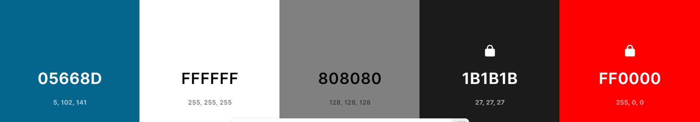

## Typography

The primary font utilized is font-family: Roboto, sans-serif; for the intro message while Puppies Play
was employed for the main logo text on 

## Logo and Favicon

The logo was crafted utilizing an online logo creator - [Favicon](https://favicon.io/)

## Wireframes

- Mobile Homepage Wireframe

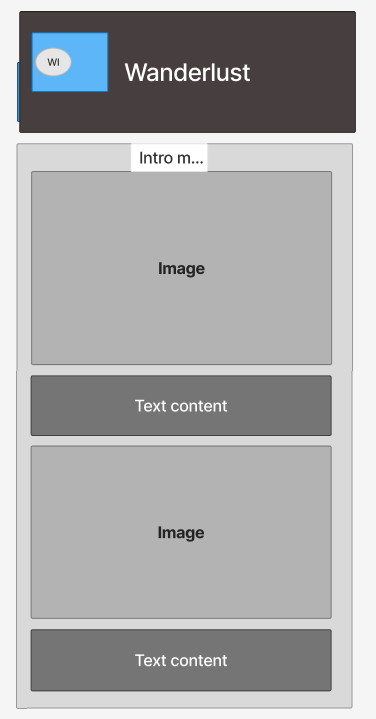

- Mobile Post Detail Wireframe

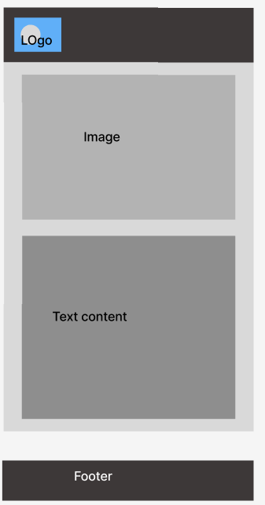

- Desktop Homepage Wireframe

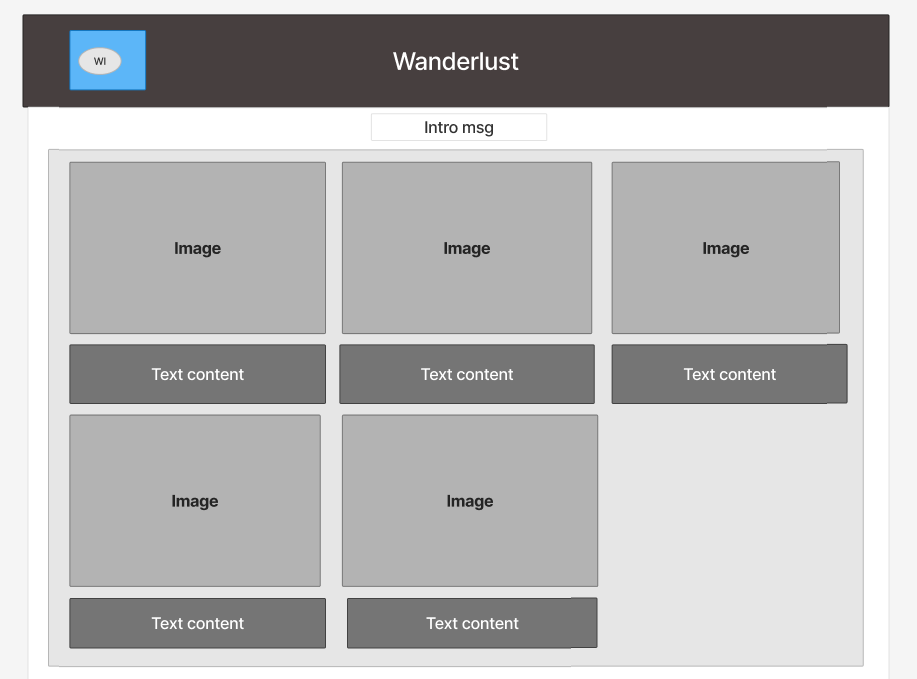

- Desktop Post Detail Wireframe

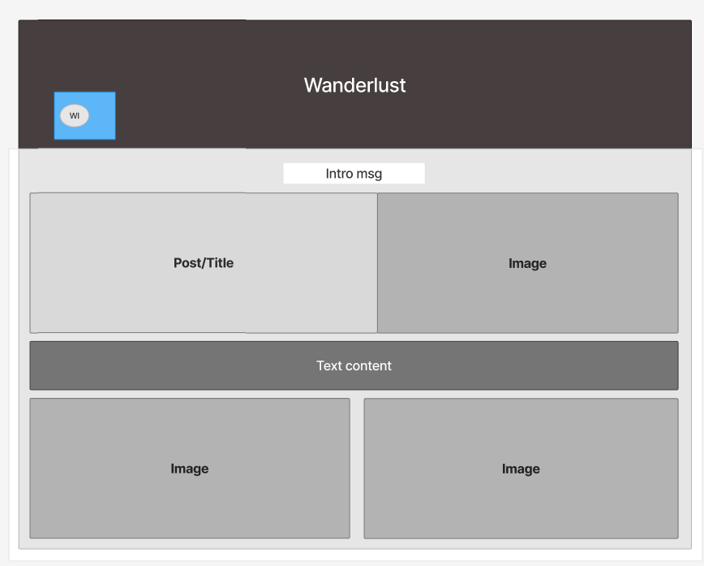

## Flow Diagram

Here is a diagram illustrating the potential flow through the site. It comprises two sections: on the left, it depicts the Admin, and on the right, it represents a site user.

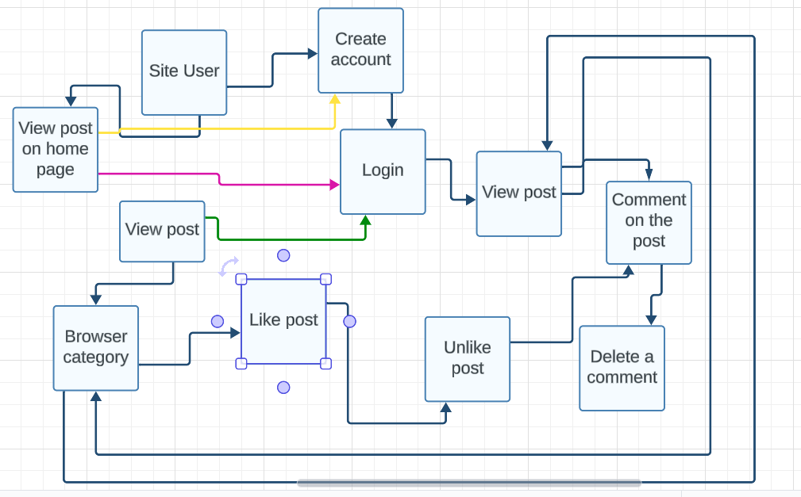

## Database Plan

The database plan is relatively straightforward, outlining the stored information, data types, and identifying primary or foreign keys where relevant.

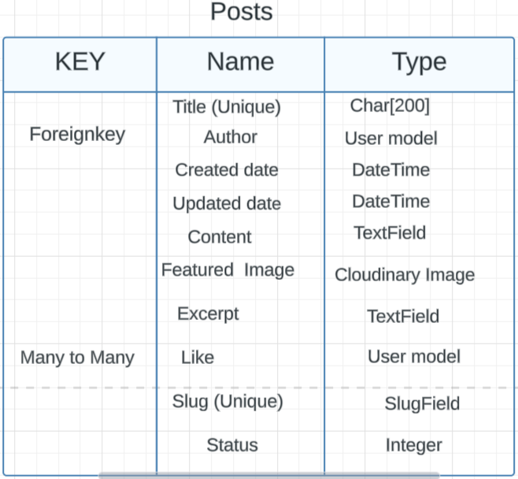

# Features

## Registration

The user can create an account

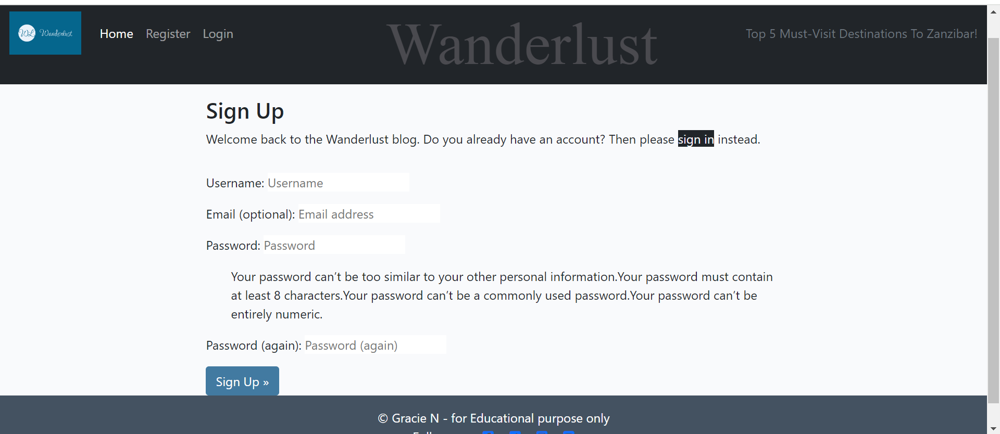

View Blog Posts on Home Page

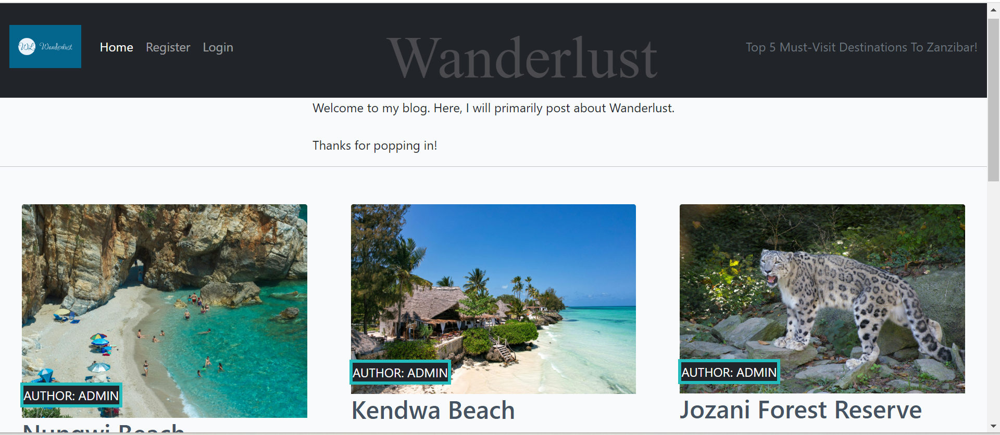

Browse by Post Category

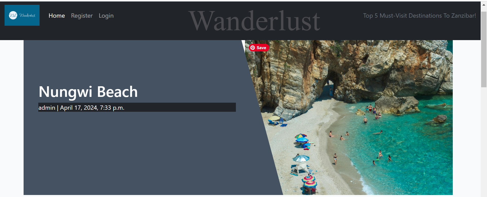
 
Comment on Blog Posts.

*Also depicted here is the trashcan icon, which enables users to delete their own comments if they choose to do so.*
*Also, there is an edit icon that allows users to edit their comments if they choose to do so.*

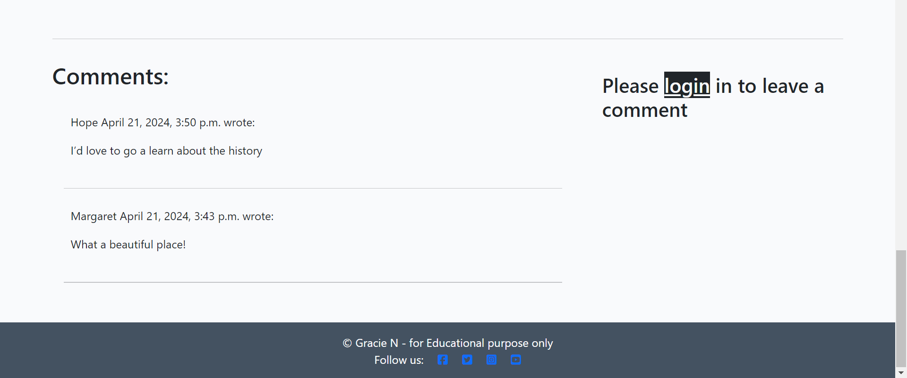

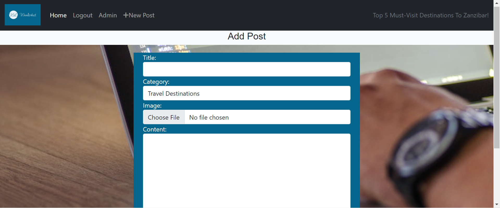

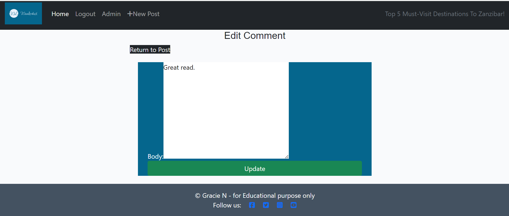

## Future Features

- Implementing a profile page for users to upload profile pictures 

## Features Not Included

Including an option for users to upload photos within comments
___

# Technologies Used

Here are the technologies used to build this project:

- [Gitpod](https://gitpod.io/) To develop and construct this project.
- [Github](https://github.com) To host and manage the data storage for the site.
- [Gitpod](https://www.codeanywhere.com) The Integrated Development Environment (IDE) used for building the site.
- [PEP8 Validator](https://pep8ci.herokuapp.com/) A tool utilized to check Python code for errors.
- [ElephandSQL](https://www.elephantsql.com/) A platform employed to store a PostgreSQL database.
- [Cloudinary](https://cloudinary.com/) Utilized as cloud storage for images uploaded as part of the blog posts.
- [Heroku](https://id.heroku.com/) Deployed the project.

# Programming Languages, Frameworks and Libraries Used

- [HTML](https://developer.mozilla.org/en-US/docs/Web/HTML)
- [CSS](https://developer.mozilla.org/en-US/docs/Learn/Getting_started_with_the_web/CSS_basics)
- [Python](https://en.wikipedia.org/wiki/Python_(programming_language))
- [Django](https://www.djangoproject.com/)
- [Bootstrap](https://getbootstrap.com/)

# Agile

This project was developed using Agile methodology, making use of the Project Board and Issues sections in GitHub.

- [Project Board](https://github.com/users/Graciekan21/projects/5/views/1)

___

## Testing

Please refer to [TESTING.md](TESTING.md) file for all testing carried out.

### Solved Bugs 

| No | Bugs | How I solved the issue |
| :--- | :--- | :--- |
| 1 | As an admin, I unintentionally liked the blog posts I posted, which was not my intention | Hiding the ability for the admin to like and unlike blog they posted |
| 2 | I encountered issues with the slug while editing a post, causing errors whenever a user attempted to edit a post | I hid labels for specific fields using Style.css |
|3 | The logo and favicon were not appearing on the deployed site | The issue was resolved by removing "Disable collectstatic" from the Heroku config variable |
| 4 | I also encountered numerous indentation errors, excessive white space, and lines that were too long (81>79) characters while validating through pep8 | This was resolved by utilizing a formatting documentation for each file |
| 5 | My static files were not loading on the deployed site | 1. Deleted the CSS folder in the Cloudinary media library (NOT in Gitpod)
2.Compared my settings.py file to the CodeStar walkthrough settings.py file to ensure that it is set correctly 3.In the Gitpod terminal, re-run the collect static command: python3 manage.py collectstatic |
| 6 | I was getting a DisallowedHost error when attempting to view the site | I had to update the ALLOWED_HOSTS in settings.py by replacing it with the one shown on the error page |
| 7 | I encountered an error in the terminal caused by the Cloudinary version. I had to | I had to install pip uninstall cloudinary
pip install cloudinary==1.25.0
pip freeze > requirements.tx and the pip uninstall dj3-cloudinary-storage
pip install dj3-cloudinary-storage==0.0.5
pip freeze > requirements.txt, then run server and it worked as it should |

### known Bugs
On the Register page, I noticed some errors during validation, but they don't seem to affect the app, and none of the users have complained about anything. I believe they are caused by Django. 

## Deployment

### Github Deployment

To store the website, I utilized GitHub for both data storage and version control. Here's how it was done:
After making any additions, changes, or removals of code, in the terminal within your IDE (I used Gitpod for this project), type:
- git add 
- git commit -m "meaningful commit message"
- git push

The files are now accessible for viewing within your GitHub repository.

### Creating a Fork or Copying

To clone/fork/copy the repository, you click on the "Fork" tab located next to the "Unwatch" tab in the top right corner of the page.

### Clone

To create a clone you do the following;

1. Click on the code tab, left of the Gitpod tab
2. To the right of the repository name, click the clipboard icon
3. In the IED open GitBash
4. Change the working directory to the location you prefer
5. Add Git Clone with the copy of the repository name
6. Clone has been created

### Repository deployment via Heroku

- On the [Heroku Dashboard](https://dashboard.heroku.com) page, click New and then select Create New App from the drop-down menu.
- When the next page loads insert the App name and Choose a region. Then click 'Create app'
- In the settings tab click on Reveal Config Vars and add the key Port and the value 8000. The credentials for this app were:

1. Cloudinary URL
2. Postgres Database URL
3. Port (8000)

- Below, click "Add buildpack" and select "Python" first, followed by "Node.js."

### Deployment of the app

- Click on the Deploy tab and select Github-Connect to Github.
- Enter the repository name and click Search.
- Choose the repository that holds the correct files and click Connect.
- A choice is offered between manual or automatic deployment whereby the app is updated when changes are pushed to GitHub.
- Once the deployment method has been chosen the app will be built and can be launched by clicking the Open app button which should appear below the build information window, alternatively, there is another button located in the top right of the page.

___

## Credits

This project was based on the Code Institute's - I think therefore I blog walkthrough module which provided a standard blog 'base'. From this base I customised a lot of the layout and styling with Bootstrap and custom CSS. I also added a custom model for Category. This allowed me to create a functionality within the site for users to filter the blog posts by a selected category.

I also added several custom Views and Forms to the site, as well as ensuring that all links and desired functionality was working as intended with no errors.

For inspiration and fine-tuning of my code, I referred to John Elder's youtube channel [Codemy](https://www.youtube.com/@Codemycom) where I was able to get a better understanding of how to correctly create this type of product using Django and Bootstrap.

The project guide and the readme layout was based on the example by [Kasia Bogucka - Portfolio Project 4 - The guide to MVP](https://youtu.be/vIv1c6RLBac?si=3pncBJmgvJ0tgBcd ) 

I also want to aknoledge My mentor [Jubril Akolade](https://learn.codeinstitute.net/ci_support/diplomainsoftwaredevelopmentecomm/mentor) for help me to understand the project approach and how to structure the readme with[ Sdalsosa- Readme](https://github.com/Sdalsosa/ComposerHub/blob/main/README.md)
 
The wireframe mockups were created using [figma](https://www.figma.com//)
After finishing, the README file was subjected to a spelling and grammar check using.

 [ChartGPT](https://chartgpt.io/)

___

## Media

Using a stock image library like Pexels for placeholder images when none are uploaded to a blog post is a smart move. It ensures that your posts maintain visual appeal even when there's no specific image provided. Plus, it's convenient and saves time compared to creating your own placeholders. As long as you're still incorporating your original content and images throughout your blog, using stock images as placeholders shouldn't detract from your unique voice and style. It's all about striking a balance between efficiency and originality.
 All other content and images are my own.

___

## Acknowledgments and Thanks

Alan, Roo, John, Roman, Rebecca and Sarah at Code Institute's tutor support for the help and guidance with my code-related brain melts and also for the database reset guidance.

[CodeInstitute](https://learn.codeinstitute.net/courses/) CodeInstitute

For help with manual testing:

- molly
- Hope
- Marget
- Dan
- Freddie
- Sandra