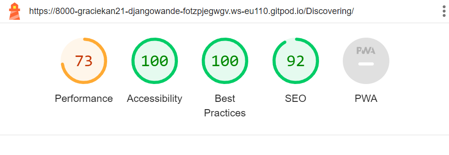

## Testing

Visit the deployed site: [wandrelust Site](https://django-wanderlust-96b58b7e2665.herokuapp.com/)

# Testing

During the project, I conducted testing for functionality and styling issues after building each section or Function/Model. Corrections or fixes were made before proceeding. 
Throughout development, I utilized Google developer tools to verify proper functionality and to aid in diagnosing unexpected issues.
I thoroughly inspected each page using Google Chrome developer tools and the Firefox inspector tool to ensure responsiveness across various screen sizes and devices. Additionally, I enlisted friends to test the site by signing up, adding, and deleting comments using various devices and platforms (IOS, Android, Mobile, Tablet, etc.), and they reported any encountered issues with functionality or styling.

___

## CONTENTS

- [AUTOMATED TESTING](#automated-testing)
  - [User](#user)
  - [Bugs](#bugs)
  - [Lighthouse](#lighthouse)
  - [MANUAL TESTING](#manual-testing)
  - [Validation Testing](#validation-testing)
    - [HTML \& CSS](#html--css)
  - [Python Testing](#python-testing)
  - [Full Testing](#full-testing)
  

## Lighthouse

The performance scores appear to be low, and I attribute this to the images uploaded for each blog post being hosted on a third-party cloud-based platform.

Mobile

Desktop

## Manual Testing

*For any failures, a more detailed description is provided below the table.*

ADMIN
| TEST | OUTCOME | PASS/FAIL|
|:---:|:---:|:---:|
| Create Blog Post | The post has been successfully created and is now visible | Pass |
| Edit Blog Post | Post content and category have been successfully updated | Pass |
| Delete User Comments | Comment successfully deleted | Pass |
| Delete Blog Post | Post deleted successfully | Pass |
| Create test posts to verify pagination | Next/Previous Page appears at the bottom of the screen | Pass |
| Like and Unlike a blog post | The admin can not like or unlike a post that they posted | Pass |
| Edit Blog post | updated successfully | pass 
| logout | Logout Successful | Pass |

## User

| TEST | OUTCOME | PASS/FAIL|
|:---:|:---:|:---:|
| Create Account | successfully created | Pass |
| Login | Login Successful | Pass |
| Logout | Logout Successful | Pass |
| Read Full Blog Post | PostDetail page loaded successfully | Pass |
| Leave a comment below the blog post | Comment Successfully Added| Pass |
| Edit a comment below the blog post | update successfully Added | Pass |
| Delete Comment | Comment Deleted | Pass |
| Filter Posts by category | Posts marked as selected category displayed successfully | Pass |
| Add a blog post | Post a blog succssfully | Pass |
| Like and Unlike a blog post that you did not create | Successfully | Pass |
| Any character, such as a space, or submitting an empty form while editing or adding a post. | It will provide feedback indicating invalid input. | Pass|

## Bugs 
- Fixed

| No | Bugs | How I solved the issue |
| :--- | :--- | :--- |
| 1 | As an admin, I was also liking the blog posts I posted. | Hiding the ability for the admin to like and unlike apost |
| 2 | I encountered issues with the slug while editing a post, causing errors whenever a user attempted to edit a post | I hid labels for specific fields using Style.css |
|3 | The logo and favicon were not appearing on the deployed site | The issue was resolved by removing "Disable collectstatic" from the Heroku config variable. |
| 4 | I also encountered numerous indentation errors, excessive white space, and lines that were too long (81>79) characters while validating through pep8 | This was resolved by utilizing a formatting documentation for each file |

## Validation Testing

### HTML & CSS

HTML & CSS testing, I used [W3 Validator](https://validator.w3.org/)

### W3C Validator

I utilized the "View Page Source" option to access the HTML code, then copied and pasted it into the W3C HTML validator of django 
 was used to validate the HTML on all pages of the website. It was also used to validate the CSS.

 - 

 - 
.png) -
 -
 -
 - 

## Python Testing

Python pep8 validation was done via [Code Institute's Python Linter](https://pep8ci.herokuapp.com/)

The only issues encountered here were with indentations and the fact that certain lines of text exceeded the 81-79 character limit, but these have now been resolved.

Python Files Tested:

- models
- forms
- views
- urls

___

### Full Testing

Full testing was performed on the following devices:

* Laptop:
  * Macbook Pro 2021 14 inch screen
* Mobile Devices:
  * iPhone 13 pro.
  * iPhone 11 pro.
  * Phone X.

___
